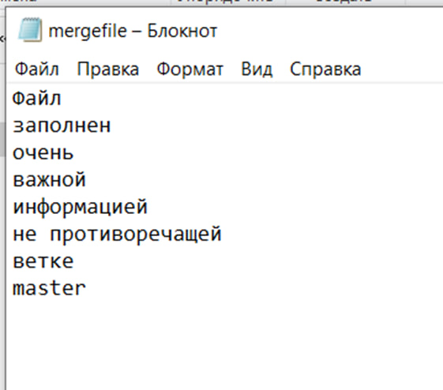

# Лабораторная работа №6

## Цель
Изучение базовых возможностей системы управления версиями, опыт работы с Git Api, опыт работы с локальным и удаленным репозиторием.

## Ход работы

1. Сделана копия в личное хранилище из указанного репозитория (рис. 1)

2. Настройка клиента git с помощью команд git config --global user.name и git config --global user.email (рис.2)

3. Клонирован личный удаленный репозиторий на компьютер с помощью команды git clone <url> (рис.3)

4. Добавлен файл через интерфейс GitHub. Подтянуты изменения в локальный репозиторий с помощью команды git pull (рис.4)

Получена история операций для каждой из веток c помощью команды git log.

Изменения подтянуты в локальных репозиториях (рис.5)

История операций для ветки master (рис.6)

Просмотрены последние изменения с помощью команды git log -p -2

История операций для ветки branch1 (рис.7)

Последние изменения ветки master (рис.8)

Последние изменения ветки branch1 (рис.9)

Выполнено слияние в ветку master c помощью команды git merge branch1. (рис.10)

Разрешен конфликт (рис.11)

Сделаны и зафиксированы изменения с помощью команд git add и git commit -m <commit> (рис.12)

Удалена побочная ветка branch1 после слияния с помощью команды git branch -d branch1 (рис.13)

Добавлен файл new_file_1.txt (рис.14)

Изменён файл new_file_1.txt (рис.15)

Добавлено изменение (рис.16)

Итоговая история операций (рис.17)

Сделан откат коммита с помощью команды git reset —hard HEAD~1(рис.18)

Создана ветка для отчёта с помощью команды git checkout -b report (рис.19)

Оформлен отчет в файле README.md с помощью Visual Studio Code (рис.20)

Получена история операций в форматированном виде c помощью команды git log --pretty=format: "%h - %ad - %an: %s" --date=short 